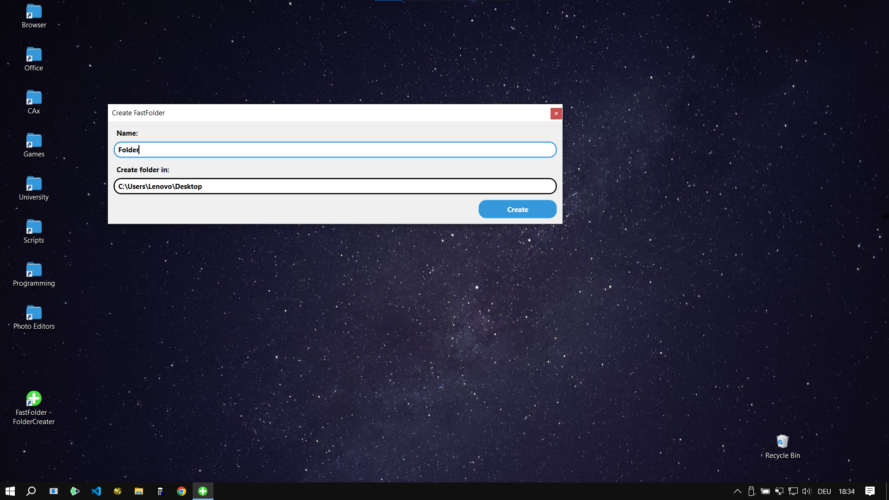
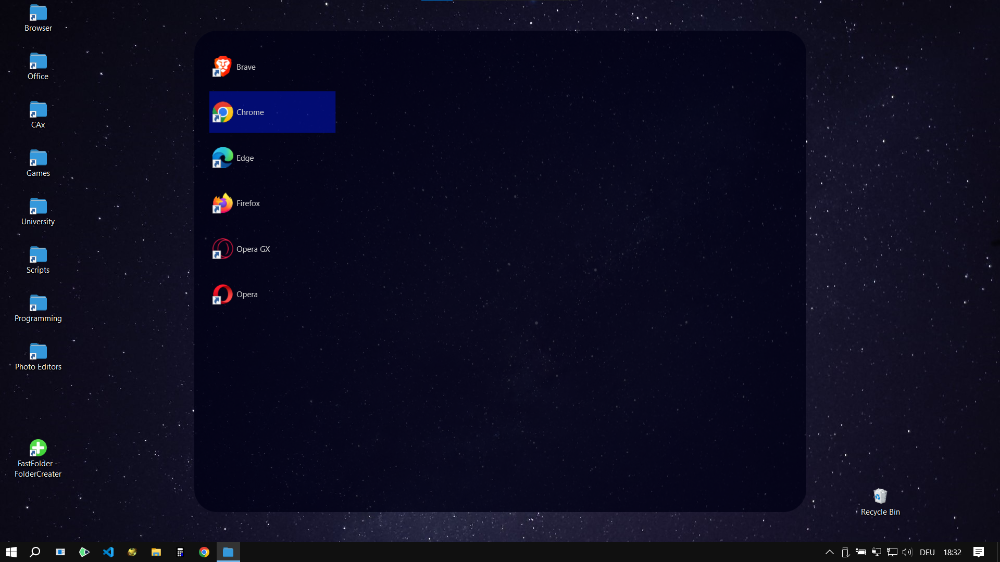

# FastFolder
## Work in progress...
FastFolders is a Windows application that lets you create modern-looking, fast-access folders. This helps you organize your desktop and more.
## Short Demo

## Installation
Download and run `FastFolder_Setup.exe`. <!-- TODO: Alternatives -->
## How to use
### Create a FastFolder
Create a FastFolder using the FolderCreater, found in the start menu.
### Move Files into a FastFolder
Move files via drag and drop in the FastFolder.
### Move Files out of a FastFolder
You can also move files out of the FastFolder using drag and drop. Alternatively, you can open the folder in the standard 'File Explorer' by selecting `right-click > Open folder in File Explorer`.
## Screenshots

## Credits
- Thanks to [Custom Icon Design](https://www.customicondesign.com/) for plus icon
- Thanks to [paomedia](https://github.com/paomedia) for folder icon
